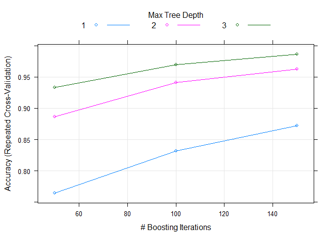
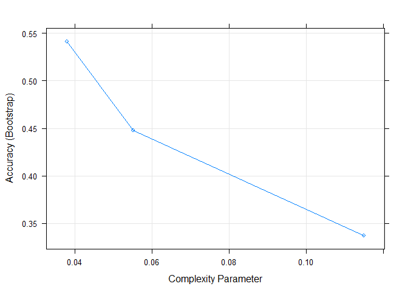
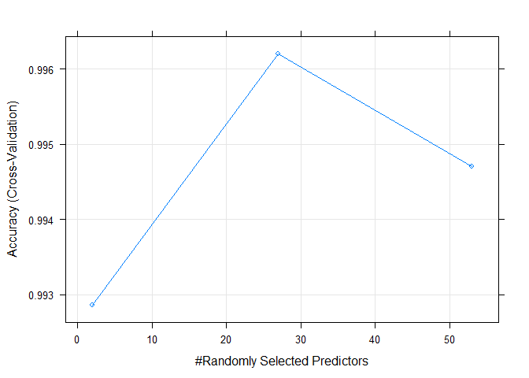

## Overview:

The human activity recognition research has traditionally focused on discriminating between different activities, i.e. to predict "which" activity was performed at a specific point in time.The approach we propose for the Weight Lifting Exercises data is to investigate "how (well)" an activity was performed by the wearer. The "how (well)" investigation has only received little attention so far, even though it potentially provides useful information for a large variety of applications,such as sports training.

Six young health participants were asked to perform one set of 10 repetitions of the Unilateral Dumbbell Biceps Curl in five different fashions: exactly according to the specification (Class A), throwing the elbows to the front (Class B), lifting the dumbbell only halfway (Class C), lowering the dumbbell only halfway (Class D) and throwing the hips to the front (Class E).

Class A corresponds to the specified execution of the exercise, while the other 4 classes correspond to common mistakes. Participants were supervised by an experienced weight lifter to make sure the execution complied to the manner they were supposed to simulate. The exercises were performed by six male participants aged between 20-28 years, with little weight lifting experience. We made sure that all participants could easily simulate the mistakes in a safe and controlled manner by using a relatively light dumbbell (1.25kg).More information is available from the website here: http://groupware.les.inf.puc-rio.br/har. 

### Data

The main goal of this  project is to predict the manner in which they did the exercise. Also to use the  prediction model to predict 20 different test cases.

The training data for this project are available here:

https://d396qusza40orc.cloudfront.net/predmachlearn/pml-training.csv

The test data are available here:

https://d396qusza40orc.cloudfront.net/predmachlearn/pml-testing.csv


## Analysis

1. Data Loading and Cleaning:


```r
## Installing the libraries and loading the data

library(caret)
```

```
## Loading required package: lattice
```

```
## Loading required package: ggplot2
```

```r
library(rpart)

training<-read.csv("https://d396qusza40orc.cloudfront.net/predmachlearn/pml-training.csv", header = TRUE, na.strings=c("NA","#DIV/0!",""))
testing<- read.csv("https://d396qusza40orc.cloudfront.net/predmachlearn/pml-testing.csv", header = TRUE, na.strings=c("NA","#DIV/0!",""))

 ## Removing NA from data set 
training<-training[,colSums(is.na(training)) == 0]
testing <-testing[,colSums(is.na(testing)) == 0]

##Remove columns that are not predictors, which are the first six columns
training <-training[,-c(1:6)]
testing <-testing[,-c(1:6)]
```

2. Set up data


```r
## Split the data into 2 parts. We use 70% of the data to train our model and the remaining 30% to validate it
set.seed(2345)
inTrain <- createDataPartition(training$classe, p=0.75, list=FALSE)  
training_data<- training[inTrain, ]
validation_data<-training[-inTrain, ]
validation_data$classe<-as.factor(validation_data$classe)
```

3. Build the model using different algorithms


```r
set.seed(2345)
training$classe<-as.factor(training$classe)

## 1. gbm - Generalized Boosted Regression Modeling 
model_gbm<-train(classe ~ ., data = training_data,  method = "gbm", trControl = trainControl(method="repeatedcv", number = 5,repeats = 1), 
                 verbose = FALSE)

## 2. lda - Linear Discriminant Analysis
model_lda<-train(classe ~ ., data = training_data,  method = "lda")

## 3. rpart - Recursive Partitioning and Regression Trees
model_rpart<-train(classe ~ ., data = training_data,  method = "rpart")

## 3. rf - Random Forest
model_rf<-train(classe ~ ., data = training_data,  method = "rf", trControl = trainControl(method = "cv", number = 3))
```

4. Prediction on Validation data set


```r
##Prediction using gbm model
prediction_gbm<- predict(model_gbm, validation_data)
confusionMatrix_gbm<- confusionMatrix(prediction_gbm, validation_data$classe)
print(confusionMatrix_gbm)
```

```
## Confusion Matrix and Statistics
## 
##           Reference
## Prediction    A    B    C    D    E
##          A 1387   10    0    0    0
##          B    7  926    4    4    1
##          C    0   12  843    9    1
##          D    1    1    7  790    9
##          E    0    0    1    1  890
## 
## Overall Statistics
##                                           
##                Accuracy : 0.9861          
##                  95% CI : (0.9825, 0.9892)
##     No Information Rate : 0.2845          
##     P-Value [Acc > NIR] : < 2.2e-16       
##                                           
##                   Kappa : 0.9825          
##                                           
##  Mcnemar's Test P-Value : NA              
## 
## Statistics by Class:
## 
##                      Class: A Class: B Class: C Class: D Class: E
## Sensitivity            0.9943   0.9758   0.9860   0.9826   0.9878
## Specificity            0.9972   0.9960   0.9946   0.9956   0.9995
## Pos Pred Value         0.9928   0.9830   0.9746   0.9777   0.9978
## Neg Pred Value         0.9977   0.9942   0.9970   0.9966   0.9973
## Prevalence             0.2845   0.1935   0.1743   0.1639   0.1837
## Detection Rate         0.2828   0.1888   0.1719   0.1611   0.1815
## Detection Prevalence   0.2849   0.1921   0.1764   0.1648   0.1819
## Balanced Accuracy      0.9957   0.9859   0.9903   0.9891   0.9936
```

```r
plot(model_gbm)
```

<!-- -->

```r
## Prediction using lda model
prediction_lda<- predict(model_lda, validation_data)
confusionMatrix_lda<- confusionMatrix(prediction_lda, validation_data$classe)
print(confusionMatrix_lda)
```

```
## Confusion Matrix and Statistics
## 
##           Reference
## Prediction    A    B    C    D    E
##          A 1124  120   79   35   35
##          B   42  608   81   35  136
##          C  100  126  581  103   86
##          D  119   39   86  606   73
##          E   10   56   28   25  571
## 
## Overall Statistics
##                                           
##                Accuracy : 0.7117          
##                  95% CI : (0.6988, 0.7243)
##     No Information Rate : 0.2845          
##     P-Value [Acc > NIR] : < 2.2e-16       
##                                           
##                   Kappa : 0.6357          
##                                           
##  Mcnemar's Test P-Value : < 2.2e-16       
## 
## Statistics by Class:
## 
##                      Class: A Class: B Class: C Class: D Class: E
## Sensitivity            0.8057   0.6407   0.6795   0.7537   0.6337
## Specificity            0.9233   0.9257   0.8975   0.9227   0.9703
## Pos Pred Value         0.8069   0.6741   0.5833   0.6566   0.8275
## Neg Pred Value         0.9228   0.9148   0.9299   0.9503   0.9217
## Prevalence             0.2845   0.1935   0.1743   0.1639   0.1837
## Detection Rate         0.2292   0.1240   0.1185   0.1236   0.1164
## Detection Prevalence   0.2841   0.1839   0.2031   0.1882   0.1407
## Balanced Accuracy      0.8645   0.7832   0.7885   0.8382   0.8020
```

```r
## Prediction using rpart
prediction_rpart<- predict(model_rpart, validation_data)
confusionMatrix_rpart<- confusionMatrix(prediction_rpart, validation_data$classe)
print(confusionMatrix_rpart)
```

```
## Confusion Matrix and Statistics
## 
##           Reference
## Prediction    A    B    C    D    E
##          A 1265  380  400  319   95
##          B   30  341   29  151   69
##          C   97  228  426  297  188
##          D    0    0    0    0    0
##          E    3    0    0   37  549
## 
## Overall Statistics
##                                           
##                Accuracy : 0.5263          
##                  95% CI : (0.5122, 0.5404)
##     No Information Rate : 0.2845          
##     P-Value [Acc > NIR] : < 2.2e-16       
##                                           
##                   Kappa : 0.3823          
##                                           
##  Mcnemar's Test P-Value : < 2.2e-16       
## 
## Statistics by Class:
## 
##                      Class: A Class: B Class: C Class: D Class: E
## Sensitivity            0.9068  0.35933  0.49825   0.0000   0.6093
## Specificity            0.6597  0.92946  0.79995   1.0000   0.9900
## Pos Pred Value         0.5144  0.55000  0.34466      NaN   0.9321
## Neg Pred Value         0.9468  0.85808  0.88304   0.8361   0.9184
## Prevalence             0.2845  0.19352  0.17435   0.1639   0.1837
## Detection Rate         0.2580  0.06954  0.08687   0.0000   0.1119
## Detection Prevalence   0.5014  0.12643  0.25204   0.0000   0.1201
## Balanced Accuracy      0.7833  0.64439  0.64910   0.5000   0.7997
```

```r
plot(model_rpart)
```

<!-- -->

```r
## Prediction using rf model

prediction_rf<- predict(model_rf, validation_data)
confusionMatrix_rf<- confusionMatrix(prediction_rf, validation_data$classe)
print(confusionMatrix_rf)
```

```
## Confusion Matrix and Statistics
## 
##           Reference
## Prediction    A    B    C    D    E
##          A 1394    7    0    0    0
##          B    0  942    0    0    0
##          C    0    0  855    4    0
##          D    0    0    0  799    0
##          E    1    0    0    1  901
## 
## Overall Statistics
##                                           
##                Accuracy : 0.9973          
##                  95% CI : (0.9955, 0.9986)
##     No Information Rate : 0.2845          
##     P-Value [Acc > NIR] : < 2.2e-16       
##                                           
##                   Kappa : 0.9966          
##                                           
##  Mcnemar's Test P-Value : NA              
## 
## Statistics by Class:
## 
##                      Class: A Class: B Class: C Class: D Class: E
## Sensitivity            0.9993   0.9926   1.0000   0.9938   1.0000
## Specificity            0.9980   1.0000   0.9990   1.0000   0.9995
## Pos Pred Value         0.9950   1.0000   0.9953   1.0000   0.9978
## Neg Pred Value         0.9997   0.9982   1.0000   0.9988   1.0000
## Prevalence             0.2845   0.1935   0.1743   0.1639   0.1837
## Detection Rate         0.2843   0.1921   0.1743   0.1629   0.1837
## Detection Prevalence   0.2857   0.1921   0.1752   0.1629   0.1841
## Balanced Accuracy      0.9986   0.9963   0.9995   0.9969   0.9998
```

```r
plot(model_rf)
```

<!-- -->

## Test Case Prediction 
It is observed that both rf and gbm yield the same result. Since random forest has marginally better performance (Accuracy : 0.998) than  gbm model, let's test our model in the 20 test case data set.


```r
prediction_rf_testing<-predict(model_lda, testing)
print(prediction_rf_testing)
```

```
##  [1] B A B A C E D D A A D A B A B A A B B B
## Levels: A B C D E
```
